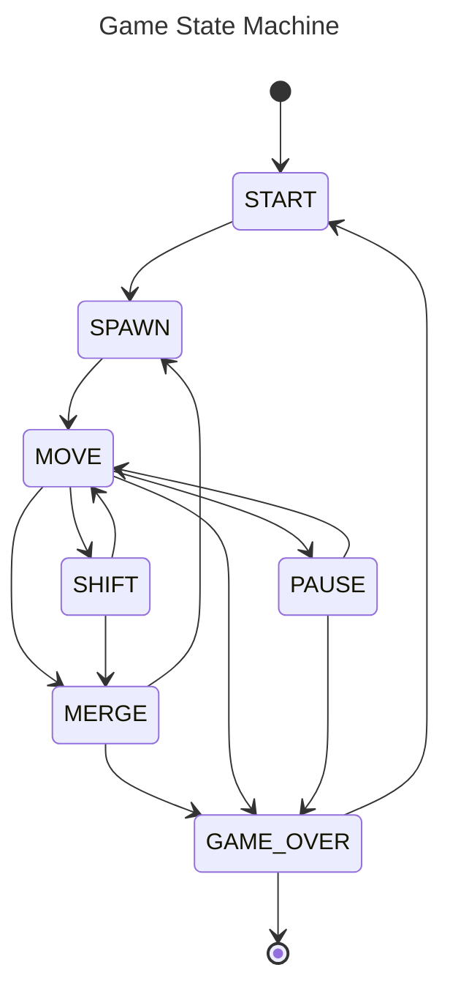

# Tetris (C, ncurses)

> A modular Tetris implementation in C focused on clean architecture, state-driven logic, and testability.

---

## Preview


---

## Purpose

This project was built to demonstrate:

* ability to design **modular architecture**
* clear separation between **core logic and interface**
* implementation of a **finite state machine (FSM)**
* writing **testable code in C**
* using **unit tests with mocks**
* building a complete CLI application from scratch

Although implemented in C, the same principles directly apply to higher-level development (e.g. Python).

---

## Overview

This is a terminal-based Tetris game built with **ncurses**.

The project is intentionally structured as a **layered system**, where:

* the **core game logic** is completely independent
* the **API layer** connects logic and interface
* the **CLI layer** handles rendering and user input only

No module has unnecessary knowledge about others.

---

## Architecture

The project is designed as a **layered system** with a strict separation of responsibilities between components.

### Layers

* **core**
  
  Contains the entire game logic:

  * game state management (finite state machine)
  * tetromino behavior
  * field updates and collision handling
  * scoring and level progression
    This layer is independent and does not interact with input/output directly.

* **api**
  
  Acts as a boundary between the core and external layers:

  * exposes only the necessary data (`GameInfo`, current state)
  * hides internal implementation details
  * provides controlled access via functions (`get_*`)

* **cli**
  
  Responsible for:

  * user input handling
  * rendering using ncurses
    It does not contain game logic and communicates only through the API.

* **shared**
  
  Contains common configuration and constants used across multiple layers.

---

### Design Principles

* **Separation of concerns**
  
  Each layer has a clearly defined responsibility.

* **Encapsulation**
  
  Internal data structures are not exposed directly.
  All interaction with the core happens through the API.

* **No cyclic dependencies**
  
  Modules are organized to avoid mutual dependencies.

* **State-driven logic**
  
  The game flow is controlled by a finite state machine, making behavior explicit and predictable.

* **Controlled memory management**
  
  Dynamic memory allocation is minimal and centralized.
  Memory is allocated only where necessary (e.g. player name) and managed within a single module, avoiding scattered ownership and reducing the risk of leaks.

---

### Rationale

This structure allows:

* independent development and testing of the core logic
* easier reasoning about system behavior
* clear boundaries between logic and presentation
* reuse of the backend with different frontends (not limited to CLI)

Overall, the architecture prioritizes **clarity, maintainability, and testability**.

---

## Game State Machine

Main states:

* `START`
* `SPAWN`
* `MOVE`
* `SHIFT` (continuous movement on key hold)
* `MERGE`
* `PAUSE`
* `GAME_OVER`



---

## Module Dependencies

Dependency direction is strictly enforced:

```
cli → api → core
```

[module dependencies will be here]

---

## Features

* Classic Tetris gameplay
* Terminal UI (ncurses)
* Score system with high score persistence
* Level progression (speed increases)
* Continuous movement on key hold
* Fully testable backend
* No global state leaks outside API

---

## Controls

| Key   | Action             |
| ----- | ------------------ |
| ← / → | Move left / right  |
| ↓     | Immidiate fall     |
| ↑     | Rotate piece       |
| SPACE | Pause / resume     |
| ENTER | Start game         |
| ESC   | Exit               |

---

## Scoring

* 1 line  → 100 points
* 2 lines → 300 points
* 3 lines → 700 points
* 4 lines → 1500 points

Level increases every **600 points**.

---

## Project Structure

```
src/
├── core/
├── api/
├── cli/
├── shared/
└── build/

tests/
```

---

## Build

### Requirements

* gcc
* make
* ncurses
* check (for tests)

### Commands

```bash
make            # build library
make gui        # build executable
make release    # full build
```

---

## Run

```bash
./build/bin/tetris
```

---

## Tests

```bash
make tests
```

* unit tests written with **Check**
* modules tested in isolation
* custom mocks for dependency control
* coverage report via lcov

---

## What this project demonstrates

This project reflects skills relevant for Python/backend development:

* system decomposition into independent modules
* API design between layers
* state machines for complex logic
* test isolation and mocking
* separation of business logic from UI
* predictable and maintainable code structure

---

## Limitations

* no wall-kick system for rotation (planned)
* soft drop behavior will be improved
* documentation can be expanded

---

## Future Improvements

* wall-kick implementation
* input system refinement
* improved documentation (Doxygen)
* extended gameplay features

---

## License

MIT License
