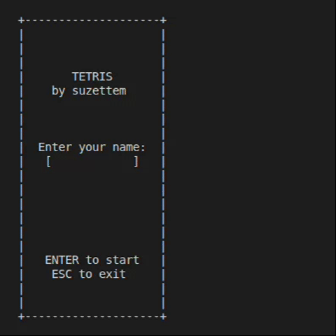
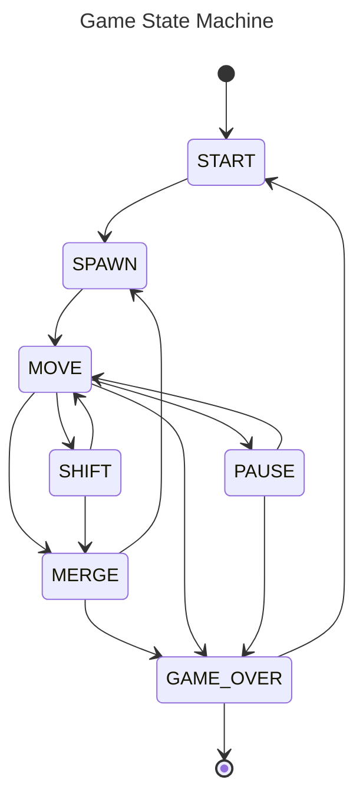

# Tetris (C, ncurses)

> A modular Tetris implementation in C focused on clean architecture, state-driven logic, and testability.

---

## Preview



---

## Purpose

This project was built to demonstrate:

* ability to design **modular architecture**
* clear separation between **core logic and interface**
* implementation of a **finite state machine (FSM)**
* writing **testable code in C**
* using **unit tests with mocks**
* building a complete CLI application from scratch

Although implemented in C, the same principles directly apply to higher-level development (e.g. Python).

---

## Overview

This is a terminal-based Tetris game built with **ncurses**.

The project is intentionally structured as a **layered modular system**, where:

* the **core layer** contains all game mechanics and state transitions
* the **game model layer** exposes read-only game data structures
* the **game loop layer** orchestrates interaction between backend and frontend
* the **CLI layer** handles rendering and user input only

The gameplay logic is fully separated from rendering and input handling.
Core modules do not depend on the interface layer and remain independently testable.

---

## Architecture

The project is organized as a modular layered system with strict responsibility boundaries between components.

### Layers

* **core**

  Contains the entire backend game logic:

  * finite state machine
  * tetromino manipulation
  * collision detection
  * field updates
  * scoring system
  * level progression
  * internal game state management

  This layer contains no rendering or terminal-specific logic.

* **game_model**

  Defines shared public game structures and enums:

  * `GameInfo_t`
  * `GameState_t`
  * `UserInput_t`

  This layer acts as a lightweight contract between backend and frontend components.

* **game_loop**

  Coordinates the application runtime:

  * receives user input from CLI
  * invokes backend state transitions
  * synchronizes rendering
  * controls automatic falling timing

  This layer is the only place where backend and frontend interact together.

* **cli**

  Responsible only for terminal interaction:

  * rendering via ncurses
  * keyboard input handling
  * screen management

  The CLI layer does not contain gameplay logic.

* **shared**

  Contains common configuration constants shared across modules.

---

### Design Principles

* **Separation of concerns**

  Each module has a single well-defined responsibility.

* **No cyclic dependencies**

  Dependencies are organized in a one-directional flow.

* **State-driven architecture**

  Gameplay behavior is controlled through an explicit finite state machine.

* **Minimal shared state**

  Game data access is controlled and centralized.

* **Controlled dynamic memory management**

  Dynamic allocation is intentionally minimal.
  Heap memory is used only for player name storage and managed exclusively inside the `game_info` module.

* **Testability**

  Core modules can be tested independently using mocks and isolated unit tests.

---

### Rationale

This structure improves:

* maintainability
* readability
* module isolation
* testability
* backend/frontend separation

It also makes the project easier to extend with alternative frontends in the future.
---

## Game State Machine

Main states:

* `START`
* `SPAWN`
* `MOVE`
* `SHIFT` (continuous movement on key hold)
* `MERGE`
* `PAUSE`
* `GAME_OVER`



---

## Module Dependencies

Dependency direction is strictly enforced.

```text
        ┌────────────┐
        │   shared   │
        └─────┬──────┘
              │
              ▼
        ┌──────────────┐
        │ game_model   │
        └─────┬────────┘
              │
      ┌───────┴────────┐
      ▼                ▼
┌──────────┐     ┌──────────┐
│   core   │     │   cli    │
└─────┬────┘     └────┬─────┘
      └────────┬──────┘
               ▼
        ┌──────────────┐
        │  game_loop   │
        └──────┬───────┘
               ▼
            main.c
```

More detailed:

[module dependencies will be here]

---

## Features

* Classic Tetris gameplay
* Terminal UI using ncurses
* Finite State Machine (FSM) architecture
* High score persistence
* Level progression with dynamic speed increase
* Continuous movement on key hold
* Modular layered architecture
* Isolated backend testing with mocks
* Doxygen documentation support
* Coverage report generation via lcov

---

## Controls

| Key   | Action             |
| ----- | ------------------ |
| ← / → | Move left / right  |
| ↓     | Immidiate fall     |
| ↑     | Rotate piece       |
| SPACE | Pause / resume     |
| ENTER | Start game         |
| ESC   | Exit               |

---

## Scoring

* 1 line  → 100 points
* 2 lines → 300 points
* 3 lines → 700 points
* 4 lines → 1500 points

Level increases every **600 points**.

---

## Project Structure

## Project Structure

```text
src/
├── core/          # Backend game logic
├── cli/           # ncurses frontend
├── game_loop/     # Runtime orchestration layer
├── game_model/    # Shared public game structures
├── shared/        # Shared configuration/constants
├── main.c         # Application entry point
└── build/

tests/
├── mocks/
└── ...
```

---

## Build

### Requirements

* gcc
* make
* ncurses
* check (for tests)
* lcov (optional, for coverage reports)
* doxygen (optional, for documentation)

### Commands

```bash
make            # build library
make gui        # build executable
make release    # build executable and static library
make tests      # run tests + generate coverage report
make dvi        # generate Doxygen documentation
make clean      # remove build artifacts
```

---

## Run

```bash
./tetris
```

---

## Tests

```bash
make tests
```

Testing is performed with the **Check** framework.

The project uses:

* isolated unit tests
* dependency mocking
* per-module testing
* coverage analysis with lcov

Coverage reports are generated automatically after test execution.

---

## What this project demonstrates

This project demonstrates engineering practices relevant for backend and systems development:

* modular architecture design
* separation of logic and presentation
* finite state machine implementation
* dependency isolation
* unit testing with mocks
* controlled memory management
* maintainable procedural C code
* layered application structure

Although implemented in C, the architectural principles directly translate to backend development in higher-level languages such as Python.

---

## Future Improvements

* wall-kick rotation system
* improved soft-drop behavior
* additional gameplay features
* expanded Doxygen documentation
* alternative frontend support

---

## License

MIT License
